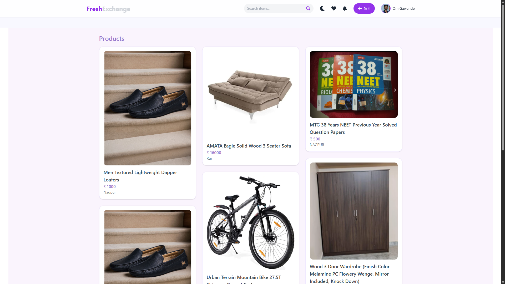
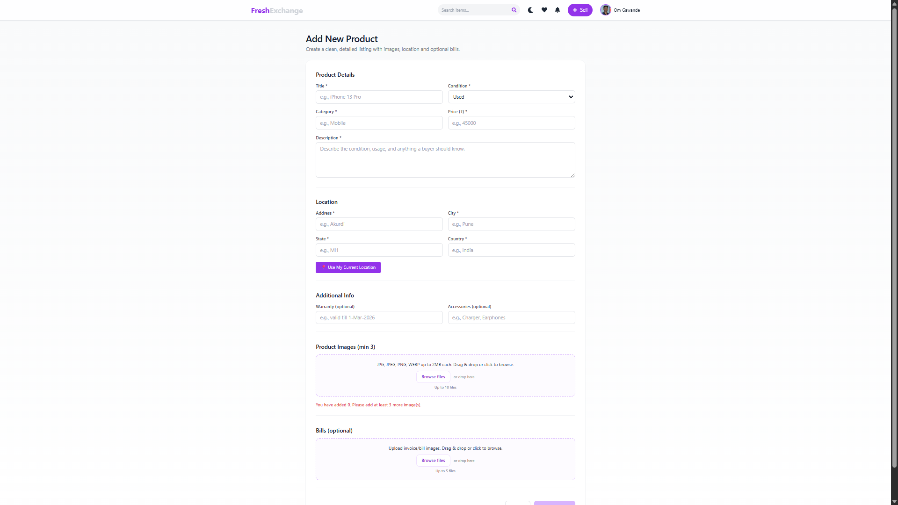
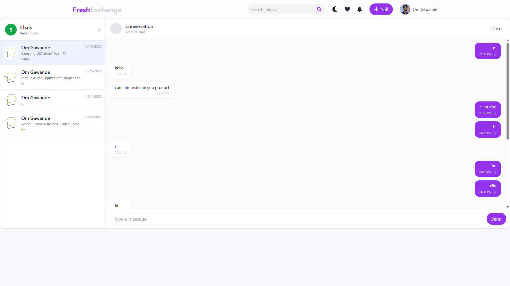
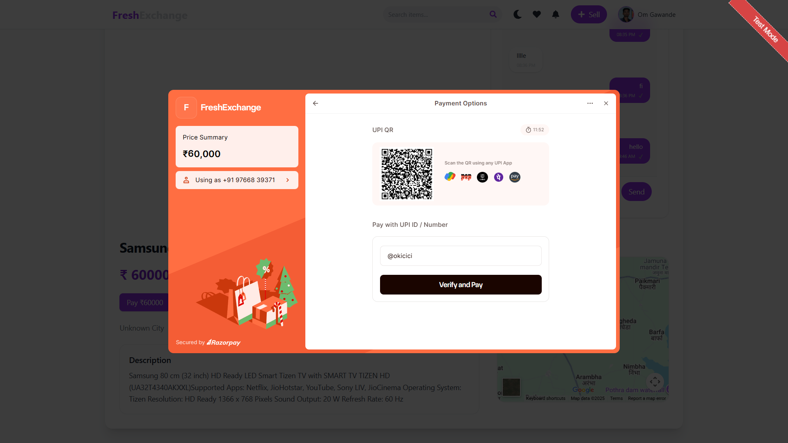
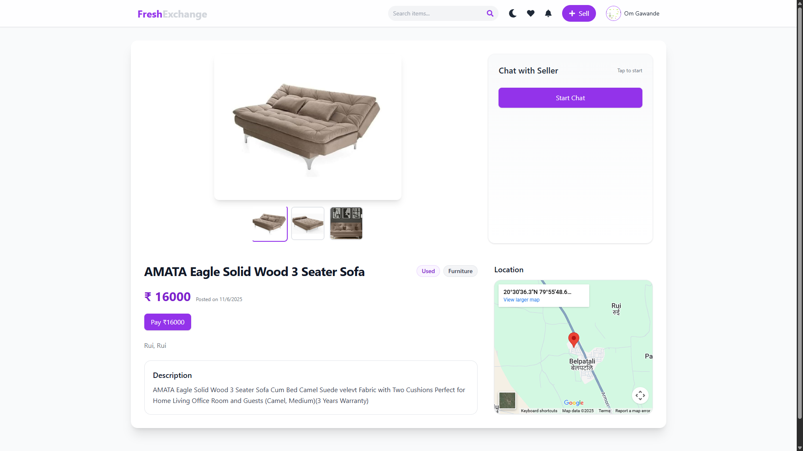

# A Secure Platform for Buying & Selling Pre-Owned Goods

A full-stack web application that enables users to securely buy and sell pre-owned products with real-time chat, online payments, and location visibility.

This project focuses on **security, trust, and usability** in second-hand marketplaces.

---

## 🌐 Live Demo

- **Frontend (Vercel):** <ADD YOUR VERCEL LINK HERE>
- **Backend API (Render):** <ADD YOUR RENDER LINK HERE>

---

## 🛠️ Tech Stack

### Frontend
- React
- Tailwind CSS / CSS
- Axios

### Backend
- Node.js
- Express.js
- MongoDB
- JWT Authentication

### Integrations
- Google OAuth
- Razorpay Payment Gateway
- Map integration for product location

---

## 🚀 Features

- **User Authentication**
  - Secure user signup & login using **JWT**
  - Login with **Google OAuth**

- **Product Listing**
  - Sellers can list products using a sell form
  - Upload **product images** and **purchase bills**
  - Product details stored securely in database

- **Real-Time Chat System**
  - Buyers and sellers can chat with each other
  - **Persistent chat** (messages remain after refresh/login)
  - Enables direct communication before purchase

- **Payments**
  - Integrated **Razorpay payment gateway**
  - Secure online payments for product purchases

- **Product Location**
  - Map view showing the **location of the product**
  - Helps buyers understand where the item belongs to

---

## 📸 Screenshots

> Add screenshots of:
- Home page

- Product listing page

- Chat interface

- Payment screen

- Map view

